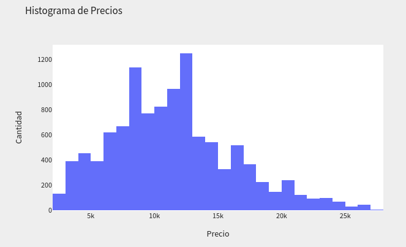

# Books Analysis Dashboard

An application made with Streamlit that shows different types of Analysis for the books of the
[Buscalibre](https://www.buscalibre.cl/) web page.

It has univariate, bivariate and multivaraite analyses, which try to understand what factors
influence the rating that people give to each product. It also has a prediction model that guess the
reviews of a given book based on the previous analysis.

## Requirements

The project was developed in a Python 3.9 environment using the following libraries:

1. [NumPy](https://numpy.org/)
2. [Pandas](https://pandas.pydata.org/)
3. [Plotly](https://plotly.com/)
4. [Scikit-Learn](https://scikit-learn.org/stable/)
5. [SciPy](https://scipy.org/)
6. [SpaCy](https://spacy.io/)
7. [Stop-Words](https://pypi.org/project/stop-words/)
8. [LightGBM](https://lightgbm.readthedocs.io/en/latest/)
9. [Streamlit](https://streamlit.io/)

And for the data scraping:

10. [Scrapy](https://scrapy.org/)
11. [Psycopg](https://www.psycopg.org/)

One can run the dashboard locally by first installing the dependencies executing

```
pip install -r requirements.txt
```

and then, on terminal issuing

```
streamlit run dashboard.py
```

## Data

The data was scraped with Scrapy, from the express shipping section of
[Buscalibre](https://www.buscalibre.cl/libros-envio-express-chile_t.html) website. And stored into a
PSQL database.

To re-download the data run

```
cd data
scrapy crawl buscalibre
```

And if you want a csv format of the data (containing less than 15k books), inside the data folder
run

```
python generate_csv.py
```

## Examples

Univariate Analysis:



Bivariate Analysis:


Multi-variate Analysis:


## Support

Give a :star: if you like it :hugs:.